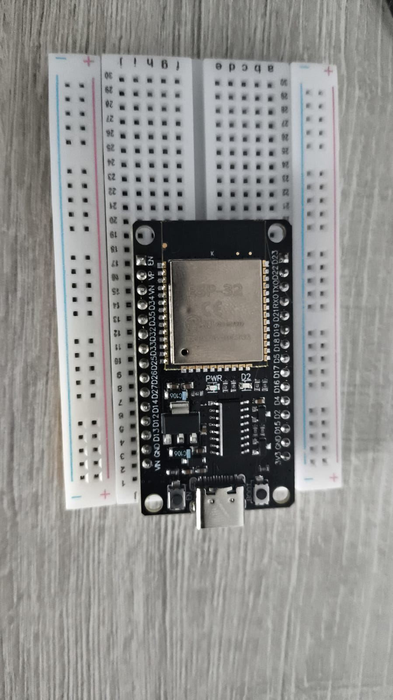

# Carrro Automata:
Proyecto de un carro autómata realizado en C++ para la materia de autómatas, enfocado en superar obstáculos de forma autónoma.
## Introduccion 
En base a los conocimientos básicos aprendidos en la materia de autómatas de la universidad cooperativa de Colombia  sobre el manejo de componentes electrónicos y programación.
usando practicas en tinkercard, y el manejo en Arduino IDLE usando bases del lenguaje de programación  c++. Se construyo un coche que puede moverse de manera autómata y pasar por obstáculos.

### [Objetivos_del_Proyecto:](Objetivos_del_Proyecto.md)
Buscar cumplir con los requerimientos técnicos, y logísticos implementando metodologías y sistemas, para poder llevar a cabo un resultado exitoso y documentado. además de servir como material de estudio para la materia 
## Materiales del carro:
1. Tarjeta de desarrollo Wi-Fi ESP32**x1**
2. Protoboard mini color Transparente **x2**
3. Motorreductor 6VDC 200RPM **x1**
4. Puente H Dual L911S 800mA **x1**
5. Rueda Plástica con rin Azul **x3**
6. Micro Servo Tower por 9g-FC 180 **x1**
7. Base para batería 18650 x 2. SMD **x1**
8. Sensor de distancia ultrasónico 2-450cm **x1**
9. Bornera en bloque 4P **x2**
10. Cable conexión fácil Duopont H/H 15cm, 10 unidades, colores diferentes **x2**

### Funcionamiento:
El carro funciona en sinergia de los componentes electrónicos mencionados en ==Materiales del carro== y el desarrollo lógico del la programación en ArduinoIDLE basada en c++.

1. Mediante el esp32 como el componente mas importante ya que este dará las instrucciones al comportamiento del carro

2. Moto reductor con capacidades analógicas para distribuir una potencia adecuada, evitar sobrecargas de potencia y tener una estabilidad 

3. Un servomotor que funciona como la direccional del coche, esa mediante grados de recorrido permite girar el coche y tomar una dirección adecuada

4. Sensor de ecolocalización, pieza fundamental para desarrollar una lógica fuerte, y que el carro pueda desarrollarse en diferentes entornos, ya que este sensor son lo "ojos" del coche y lo que permite ejecutar acciones mediante condicionales que evalúan lo que se requiere antes de iniciar una accion 
___

## resultados:

___

## Créditos:
Universidad cooperativa de colombia

